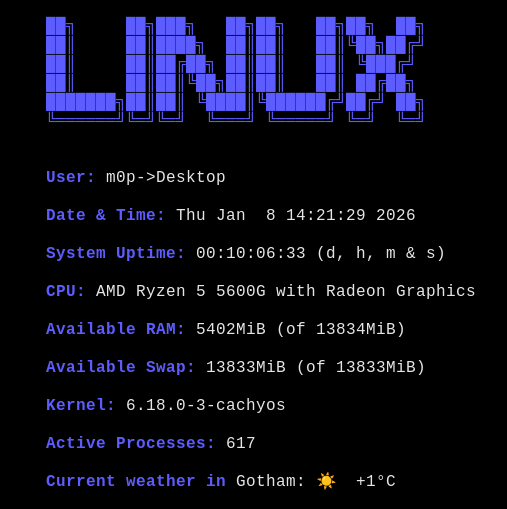

# Weather module patch for sfetch

Apply the weathermod.diff from within the original sfetch programs folder (diff -p1 < weathermod.diff) and run install.sh inside the installation folder.

# Usage 

"sfetch -u" for updating the cache manually.

The cache gets stored inside the /tmp folder, so you eventually **have** to update the cache after 
a restart of your system.

Remember: you can always tinker with the source code to change the programs behavior as we apply the suckless philosophy here: the source code is the configuration file. So if you're not lucky with some decisions or behavior, change it. There will be of course no support for applied changes. 

# Dependencies

- \>= libcurl/8.17.0

# Example:

